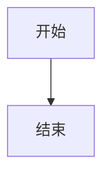

# Linefold 全功能体验

中文与 English 混排，emoji 👩‍💻 和括号（测试）。这一行用来检查点击前后行高、光标和段落位置。
普通软换行接在同一个段落；两个空格后硬换行。  
这是硬换行后的内容。

**粗体**、*斜体*、***粗斜体***、~~删除线~~、==高亮==、`inline code`、转义 \*literal\*。

## 列表与任务

- 第一项
- 第二项 **重点**
  - 嵌套项目
    1. 嵌套编号

3. 从三开始
4. 第四项

- [ ] 任务待办
- [x] 任务完成
- [/] 任务进行中
- [?] 任务疑问

> 引用第一行
> 引用第二行
>
> - 引用内列表

> [!tip]+ 可折叠提示
> 点击箭头折叠，正文仍可以编辑。

## 代码与表格

```dart
final greeting = '你好, Linefold';
print(greeting);
// A very long code line for wrapping: abcdefghijklmnopqrstuvwxyz 0123456789 abcdefghijklmnopqrstuvwxyz 0123456789 abcdefghijklmnopqrstuvwxyz
```

    indented code
    second code line

| 功能 | 状态 | 数量 |
| :--- | :---: | ---: |
| 编辑 | 可用 | 12 |
| 阅读 | 待验 | 8 |

## 链接与嵌入

[外部链接](https://example.com) / [本地笔记](Nested/目标.md) / [本页标题](#数学与脚注)

[[Nested/目标|Wiki 笔记]] 与 #project/flutter


![[Nested/目标]]



## 数学与脚注

行内数学 $E=mc^2$；金额 $10 与 $20 应保持金额。

$$
\sum_{i=1}^{n} i = \frac{n(n+1)}{2}
$$

标准脚注[^note]，同一脚注再引用[^note]，以及 ^[内联说明]。

[^note]: 这是一条脚注定义。

%%这段注释在阅读模式应隐藏%%

这段内容有块标识。 ^sample-block

## HTML 与边界

<kbd>Command</kbd> + <kbd>B</kbd>；H<sub>2</sub>O 和 x<sup>2</sup>；<mark>标记</mark>。

<details><summary>展开更多</summary>折叠中的内容。</details>

> [!unknown]- 未知类型的折叠提示
> 仍应安全展示。

---

Setext 标题
-----------

未闭合 `code、**strong、==highlight；字符串 foo_bar_baz；\$不是公式。
