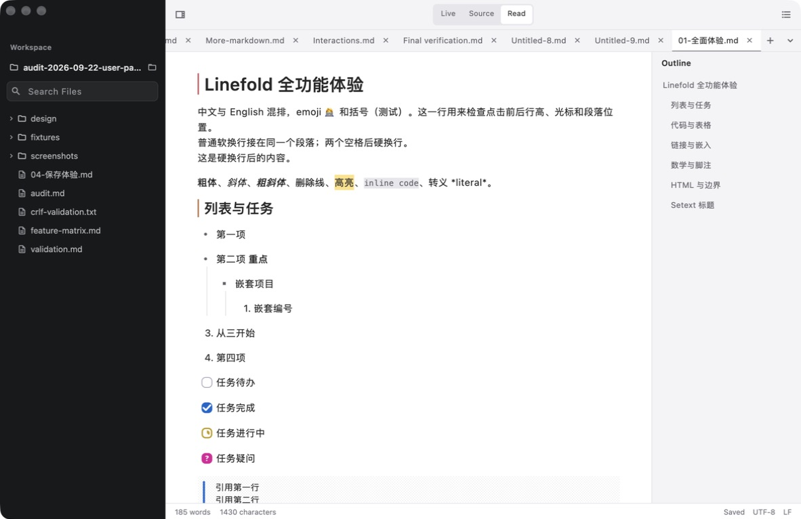
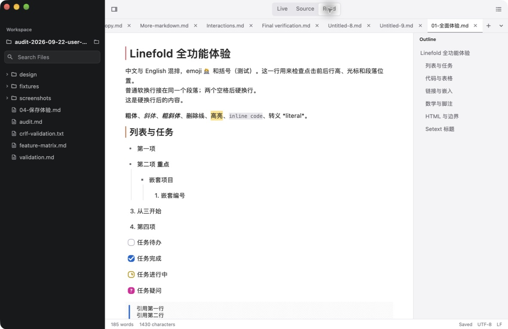
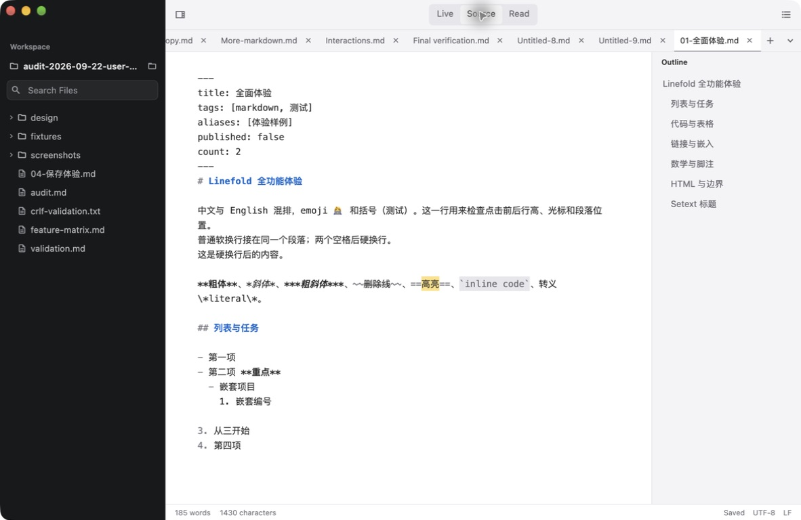
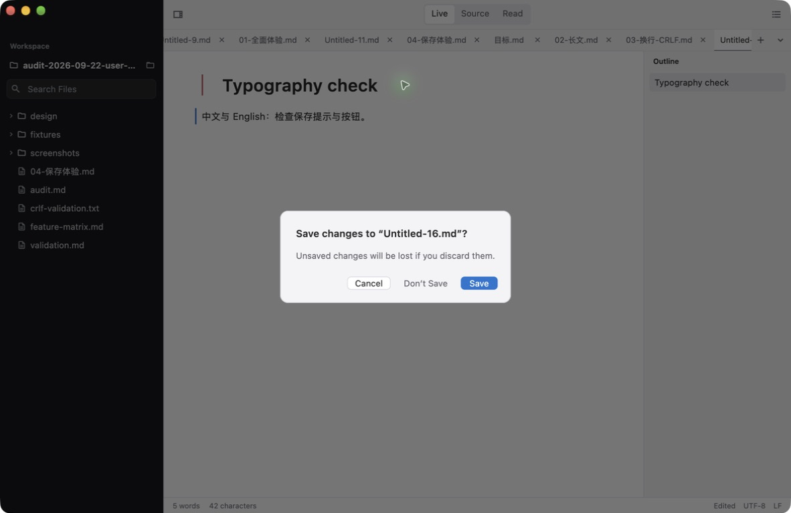
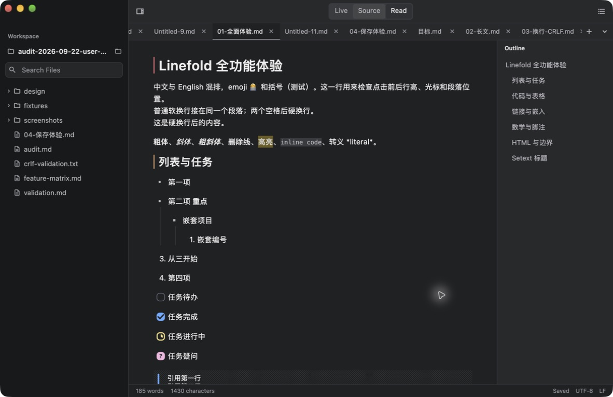
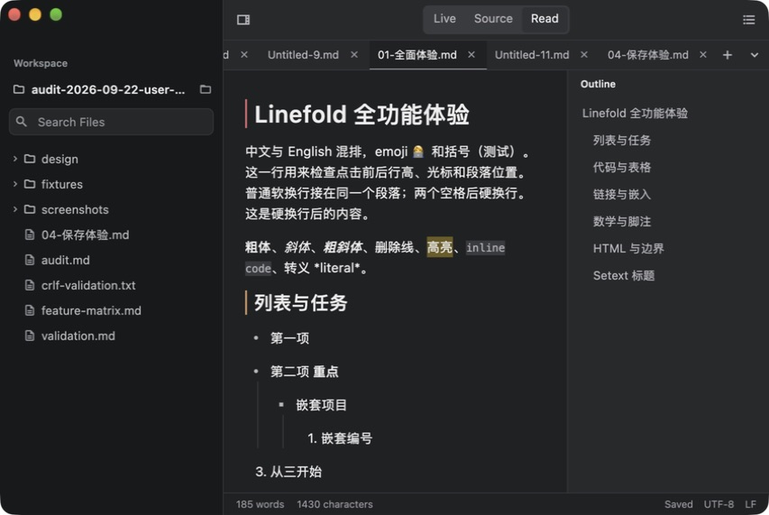
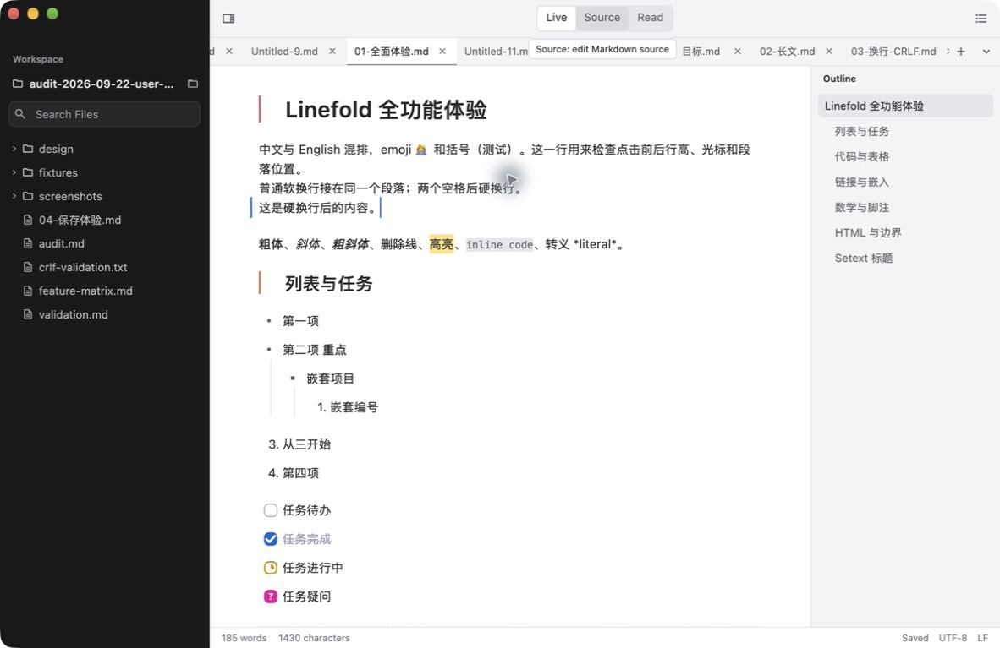

# Linefold macOS 字体评审与调整

日期：2026-09-23。范围：桌面应用的工具栏、标签页、侧栏、大纲、状态栏、提示和保存弹窗，并复核 Read、Source、Live 的内容排版。

## 依据与结论

Apple 的 [Typography](https://developer.apple.com/design/human-interface-guidelines/typography?changes=lat_2_6) 给出 macOS 默认界面字号 13 pt、最低建议 10 pt，以及各文本角色的字号、行高和强调字重。较小字号和自定义内容排版并非一概不合规；本轮重点是主要操作的可读性、角色一致性与系统字体继承。辅助文字采用 11 pt，保留高于最低建议的余量。

新增 `app/lib/src/desktop_typography.dart`，由应用主题与各界面组件共用。Flutter 逻辑像素用于对应界面中的逻辑点，截图经过捕获工具缩放，不能直接按截图像素推算字号。

| 用途 | 调整后的字号 / 行高 | 字重 |
| --- | --- | --- |
| 模式按钮、文件与目录、大纲条目、普通按钮、菜单 | 13 / 16 pt | Regular |
| 工作区名称、重要同级文字 | 13 / 16 pt | Semibold |
| 标签页、简短辅助说明 | 12 / 15 pt | Regular |
| 状态栏、搜索结果路径、快捷键、工具提示 | 11 / 14 pt | Regular |
| 侧栏与大纲分区名称 | 11 / 14 pt | Semibold |
| 保存弹窗与拖放提示标题 | 15 / 20 pt | Semibold |

完整主题另外映射了 26 / 32、22 / 26、17 / 22 的标题层级，覆盖全部 Material TextTheme 角色。界面采用 `.AppleSystemUIFont`，由系统处理多语言字体回退；显式清除额外字距，避免继承 Material 的排版参数。标题与状态文字的独立样式也包含字体族。

## 发现与处理

| 证据 | 发现 | 处理 |
| --- | --- | --- |
| 步骤 1、2；title_tabs_bar.dart | 模式文字原为 11 pt，与辅助信息同级，视觉偏小 | 提升到 13 pt；标签页保留 12 pt，统一字重与行高 |
| 步骤 1、2；workspace_sidebar.dart、floating_outline.dart | 文件项 12.5 pt、大纲 12 pt，文件项压到 1 倍行高并手工收紧字距 | 主导航统一到 13 / 16 pt，取消额外收紧字距 |
| 步骤 1、2；editor_shell.dart | 状态栏独立 DefaultTextStyle 只指定颜色和字号，未显式带入系统字体 | 使用完整的 11 / 14 pt 系统字体样式 |
| 步骤 4；desktop_theme.dart | 主题只覆盖部分文字角色，其他角色仍可能继承移动端 Material 的尺寸与字距；弹窗标题使用零散的 16 pt | 补全主题映射，弹窗标题改为 15 / 20 pt，正文和按钮使用 13 / 16 pt |

文档区域保留现有的 14.5 pt 正文、13.5 pt 等宽源码、14 pt 代码块和 Markdown 标题层级。这些是内容排版，并高于默认界面文字的可读性基线；未将长文阅读的行距压缩为控件行距。原有 SF Mono / Menlo 等宽字体回退也保留。

## 本轮截图与步骤

所有图片均在本轮从实际运行的 Linefold 捕获，保存后重新打开检查；未使用之前任务的截图作为评审证据。

### 1. 原界面：层级需要统一

原界面已有标题、导航和正文分区；工具栏模式文字较小，文件列表与大纲的文字密度不同。精确字号与字体继承问题通过源码确认。

### 2. 调整后的阅读界面：通过

模式文字、文件列表和大纲更加一致；中英文文件名按剩余空间省略，当前标签可见。正文、列表和状态栏未出现文字溢出。

### 3. Source：通过

中文、英文和 YAML 保留等宽源码排版；切换模式后界面文字层级一致，文档仍显示 Saved。

### 4. 保存弹窗：通过

使用本轮临时草稿打开保存提示。标题、说明、三个按钮清楚分层，无截断或重叠。核对后取消弹窗、撤销测试文本并关闭空草稿。

### 5. 深色外观：通过

相同字号与字重映射在深色界面保持一致，主要文字和辅助文字仍可区分。此项为视觉复核，不是完整对比度认证。

### 6. 窄窗口：通过

保留侧栏与大纲缩窄窗口，正文正常换行，当前标签、模式按钮和状态栏仍可见。较长工作区名称使用预期的省略号。

### 7. Live 聚焦编辑：通过

进入混排段落后，输入框、光标和正文可见，没有文字溢出；未修改原文内容。

## 验证与限制

- `make check` 通过：121 个 Dart 文件格式检查，根目录、example、app 三处静态分析，876 + 5 + 56 = 937 个现有测试。包括中英文标签宽度、最小窗口、保存弹窗、编辑器几何与主题切换的回归检查。详见 [验证记录](validation.txt)。
- 实机预览构建成功。本机 Xcode 拒绝项目原有的 macOS 10.15 部署目标，因此本次预览通过临时 `XCODE_XCCONFIG_FILE` 设置 12.0；仓库中的部署目标没有修改，默认构建的工具链兼容问题仍存在。
- 本次没有新增字号设置入口，没有进行 200% 字体放大、完整 VoiceOver 或所有语言脚本的检查。[Apple Accessibility](https://developer.apple.com/design/human-interface-guidelines/accessibility?changes=latest_maj_6_3&language=objc) 的扩大文字建议仍应在后续字体缩放功能中覆盖。本报告不宣称完整无障碍合规。
- 实机调试日志出现 Flutter `Failed to update ui::AXTree` 错误。视觉与键鼠检查能够完成，但无障碍树更新存在未决问题；本轮未确定来源，也未将其归因于字体调整。需另行验证 VoiceOver 与动态语义树。
- 应用界面仍由 Flutter 渲染，字体角色映射并不等同于改用 AppKit 原生控件。
