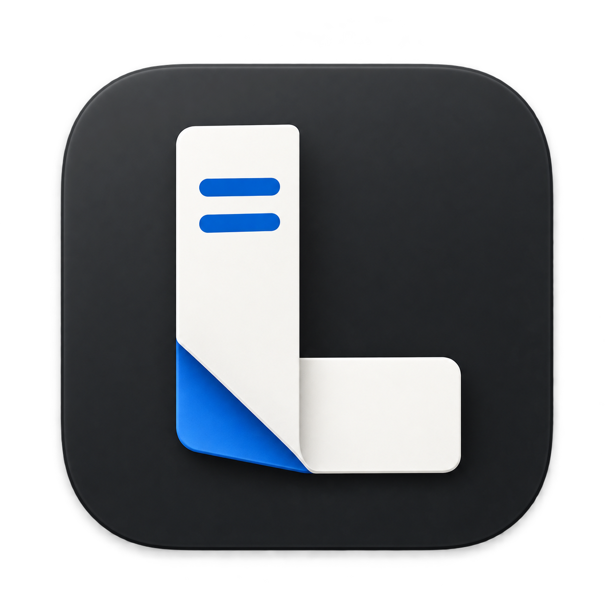

# Linefold 图标 · 折页 L



以一张折成 L 的纸页作为主形：两条蓝色横线代表文字，蓝色折面对应 Fold。
石墨色底板、白色纸面与蓝色强调沿用桌面应用的配色；轻微纸张厚度和阴影建立层次。

- 图像文件：`linefold-icon-v1.png`
- 尺寸：1254 × 1254 像素
- 格式：PNG / RGBA，圆角底板外为真实透明背景
- 生成方式：内置 `image_gen`，未使用 CLI/API fallback
- 当前用途：Linefold macOS 应用图标母版

## 应用集成

macOS 的 `AppIcon.appiconset` 使用这张母版导出的 16、32、64、128、256、512
和 1024 像素 PNG，覆盖资产目录中的 1× / 2× 图标槽位，并保留透明背景。
Xcode 在构建时将这些资源编译为应用图标。

在仓库根目录执行以下命令可重新生成全部尺寸：

```sh
bash app/tool/generate_app_icons.sh
```

导出脚本使用 macOS 自带的 `sips`，所有尺寸均直接从母版缩放。

## 最终生成提示词

```text
Use case: logo-brand
Asset type: a single finished macOS application icon for Linefold, a focused Markdown writing and file-based desktop editor.
Primary request: Design an original, memorable "line + fold" symbol. One broad ivory-white strip of paper folds once into a bold, clearly readable abstract capital L: a tall upright left stem and a generous lower arm extending right. A clean diagonal cobalt-blue fold at the lower elbow reveals the blue underside of the paper and gives the mark its distinctive signature. Place just two short, thick, carefully spaced horizontal blue strokes near the top of the white upright face, suggesting lines of writing. The fold is part of the L itself, not a separate document or another object.
Scene/backdrop: one graphite charcoal rounded-square macOS icon tile with continuous smooth corners, isolated on a genuinely transparent canvas. No background scene.
Style/medium: refined macOS app-icon rendering, precise vector-like geometry with subtle physical paper thickness and very restrained soft depth. Elegant and calm, not playful. A strong simple silhouette that remains recognizable at 32 pixels.
Composition/framing: square 1024 by 1024 master image. Exactly one icon, front-facing and centered, no perspective rotation. Tile occupies approximately 84 percent of the canvas, equal clear transparent margins around it. Large centered paper-fold L occupies about 62 percent of the tile width and height, generous deliberate negative space. Keep its silhouette bold and uncluttered.
Lighting/mood: soft upper-left studio light, thin clean edge highlights, subtle short shadow beneath the paper on the tile, only a very soft close-fitting shadow outside the tile.
Color palette: use the app's existing neutral charcoal #202122 and #28292b, ivory white, and focused macOS-style blue #0066cc with a restrained lighter blue fold highlight. High contrast, no purple or rainbow.
Materials/textures: matte dark tile, smooth clean paper with one crisp crease, minimal bevel. No noisy paper grain, no brushed metal, no busy gloss.
Text: none. The abstract L is formed by paper geometry, not typography. No wordmark, no captions, no labels.
Constraints: exactly one finished icon asset; genuinely transparent outside the rounded tile, preserve alpha; no mockup board, no grid, no repeated variations, no UI screenshot, no pen, no notebook, no Markdown hash, no brackets, no Flutter or other existing logo, no decorative sparkles, no watermark.
```
