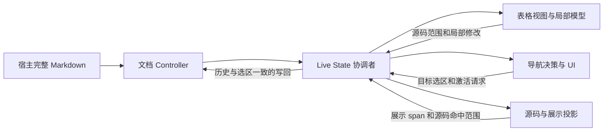

# Live Editor 内部职责与数据流

R2-04 从 `6c0e769` 开始，公共入口仍是 `IanvsMarkdownLiveEditor`。
这是同一个 Dart library 的内部拆分：`part` 文件保留私有名称、访问规则及既有调用时序，
不新增公共 API，也不把源码投影变成第二份文档数据。

## 所有者与边界

| 所有者 | 职责 | 状态与边界 |
| --- | --- | --- |
| `editor_controller.dart` | 完整 Markdown、选区/composing、历史、dirty/保存基线和解析预算 | 文档唯一数据源；各局部编辑最终写回这里 |
| `live_editor.dart` 的 State | 文档监听、块刷新、活动编辑表面、焦点/IME、历史提交及模式切换 | 拥有生命周期，按原有顺序协调局部变化和重建 |
| `live_editor/table.dart` | 表格解析/序列化、单元格输入/选择、键盘与粘贴、结构控件和拖拽 | 单元格以源码范围定位；通过既有回调提交给 State，不自行持久化文档 |
| `live_editor/navigation.dart` | 字词、行、跨块和折叠范围的导航/扩选决策；导航 UI | 读取 State 的块、选区和实际编辑几何，调用所有者的激活入口；不接管生命周期 |
| 源码投影（下一步） | 隐藏标记、引用/脚注、行内资源的展示与准确源码偏移 | 投影仅用于展示和命中映射，不能截断或覆盖原文 |

## 表格编辑

`_EditableMarkdownTable` 通过输入块构建 `_EditableTableModel`，模型携带行/列及每个单元格
在原文中的范围。局部 `_TableCellEditingController` 管理输入，格式命令使用临时 Markdown
Controller 计算替换；原生粘贴、word movement/selection/deletion 和拖拽仍走原有路径。
主 State 的 `_replaceTableCell` / `_replaceFormattedTableCell` / `_syncTableCellSelection`
负责找到当前文档中的单元格并写回；结构改动调用 `_replaceBlockSource`，保留 history/composing。

`_shiftOffsetAfterReplacement` 同时服务图片、属性等通用块替换，留在所有者，不能因为代码位置
相邻就归为表格能力。表格没有新增跨文档缓存；模型、单元格 Controller 和焦点按原有
`didUpdateWidget` / `_syncModel` / `dispose` 规则更新和释放。

## 选区导航

`_LiveEditorSelectionNavigation` 是私有 State extension，承接字词、物理/视觉行、跨块、折叠范围和文档边界的导航/扩选，以及折叠选区复制。原有 931 行方法正文保持不变；另迁移折叠桥、导航 UI 与局部/文档选区及 composing 变换，共 1,365 行。

它直接读取同一 State 的块、折叠、当前编辑范围和 `RenderEditable` 几何，更新导航锚点，并调用 `_activateDocumentCaret` / `_activateSelectionSurface` 等所有者入口。它没有独立生命周期或持久化副本。键盘路由、组合输入保护、活动表面激活及 `setState` 留在主 State；私有 extension 是职责组织边界，不声明模块间已消除耦合。

## 分步验证

1. 表格声明逐字迁移到同 library 的 part；格式器零修改，静态分析通过。迁移前后哈希和声明正文对照保留在 R2-04 证据中。
2. 每次迁移后运行现有 Live、表格宽度/链接、宿主契约、快捷键/焦点、历史和持续追加回归。它们覆盖真实交互行为，不新增仅检查文件结构的测试。
3. 导航与投影完成后运行完整 `make check`、包快照/外部宿主、公共符号及双 SDK / Native CI；确认新增内部文件进入发布快照。
4. 使用 R2-01 已通过的 `r2-candidate-1` / `r2-candidate-3` 作为同实现的前置性能结果，固定 SDK/harness/窗口和预算行为，运行两次完整后置候选并显式声明所有迁移文件。

表格及选区导航迁移已实施；源码投影和最终完整验收仍待完成，R2-04 保持进行中。
本次职责分离不声明性能改善。R2-01 已记录的完整 Source 段落排版成本及 R3-01 平台限制继续有效。
